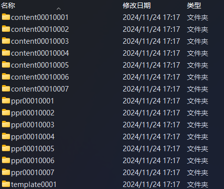
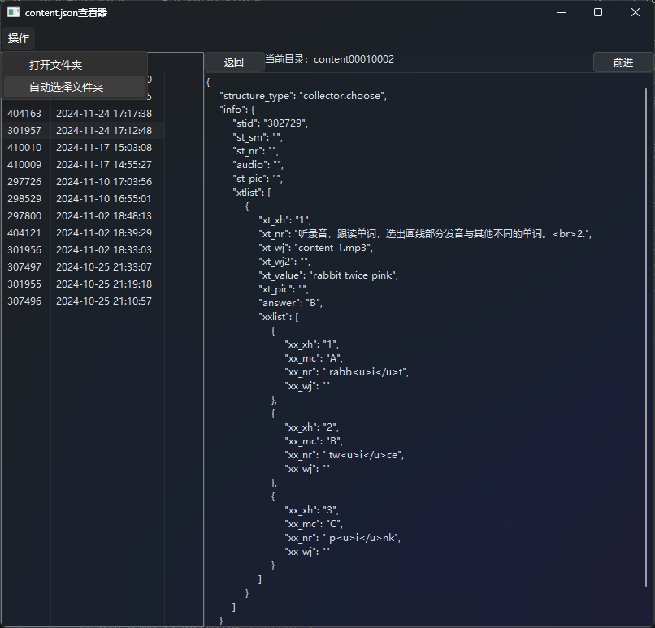

# _Ets Content Viewer_

## 介绍
你是否因为反复打开切换E听说作业文件夹而感到烦恼？

这个工具可以拯救你！
它将打开你指定的文件夹或自动选择作业文件夹，并翻页式地显示其中所有子文件夹里的content.json文件内容。

## 软件使用方法
1. 在菜单里打开或者让软件自动打开存放作业的文件夹
2. 在左边栏选中需要查看的作业
3. 在右边的文本框里查看content.json的内容, Ctr+左右键翻页, Ctrl+滚轮调整字体大小, 单击"当前文件夹: ..."来快捷切换题目文件夹
